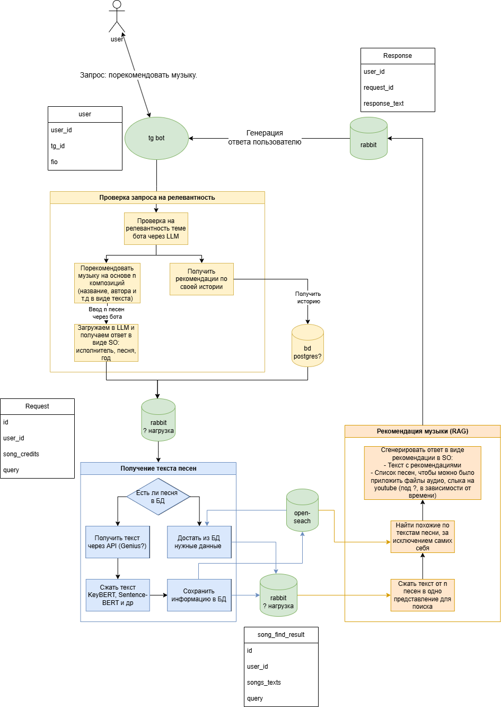

# MelodyMate: tg-music-recommendation-system

## Project Description

MelodyMate: Music Recommendation System for ITMO LLM Course. MelodyMate is a music recommendation system developed as a final project for the ITMO Large Language Models course. The project demonstrates the application of modern machine learning techniques and natural language processing to create personalized music recommendations.

## Architecture

<p align="center">
      
</p>

### Description

1. Receiving a request from the user (selecting similar ones, a free-form request for music)

   - Validating and correcting the track list of the user's request via LLM Mistral Structured Output

2. Getting the lyrics of all the songs
3. OpenSearch search for the most suitable songs (Retrieval)
4. Reply to the user with the track list and supporting information using LLM (Generation)

   - Bot creates detailed response through LLM with a description of why the songs were chosen and what we liked about the original ones.

5. All interaction is organized through RabbitMQ queues, thereby allowing efficient system scaling.

## Technology stack

- Python 3.12+
- Aiogram (asynchronous framework for the Telegram Bot API)
- Mistral LLM
- Genius API
- Opensearh engine

## Installation and configuration

### 1. Cloning a repository

```bash
git clone https://github.com/Alexander-Zadorozhnyy/tg-music-recommendation-system.git
cd tg-music-recommendation-system
```

### 2. Install docker (optional, if not already installed) - <https://docs.docker.com/engine/install/>

```bash
sudo apt remove $(dpkg --get-selections docker.io docker-compose docker-compose-v2 docker-doc podman-docker containerd runc | cut -f1)

# Add Docker's official GPG key:
sudo apt update
sudo apt install ca-certificates curl
sudo install -m 0755 -d /etc/apt/keyrings
sudo curl -fsSL https://download.docker.com/linux/ubuntu/gpg -o /etc/apt/keyrings/docker.asc
sudo chmod a+r /etc/apt/keyrings/docker.asc

# Add the repository to Apt sources:
sudo tee /etc/apt/sources.list.d/docker.sources <<EOF
Types: deb
URIs: https://download.docker.com/linux/ubuntu
Suites: $(. /etc/os-release && echo "${UBUNTU_CODENAME:-$VERSION_CODENAME}")
Components: stable
Signed-By: /etc/apt/keyrings/docker.asc
EOF

sudo apt update

sudo apt install docker-ce docker-ce-cli containerd.io docker-buildx-plugin docker-compose-plugin

# Check docker status
sudo systemctl status docker

# Verify that the installation is successful by running the hello-world image
sudo docker run hello-world
```

### 3. Setting up Environment Variables Application .env files

#### Main .env

Create a `.env` file with structure similar to [`.env.example`](./env.example) following variables:

```sh
# TG BOT Credits
BOT_TOKEN = your_token_here
ADMIN_ID = admin_tg_id_here

# DB Config
POSTGRES_HOST = postgres
POSTGRES_PORT = 5432
POSTGRES_USER = postgres
POSTGRES_PASSWORD = postgres
POSTGRES_DB = music

# Rabbitmq Config
RABBIT_HOST = rabbitmq
RABBIT_PORT = 5672
RABBIT_USER = guest
RABBIT_PASS = guest

QUEUE_REQUESTS = "requests"
QUEUE_LYRICS = "lyrics"
QUEUE_RESPONSE = "response"

# API keys
MISTRAL_API_KEY = your_token_here
GENIUS_API_TOKEN = your_token_here

# Opensearch url
OPENSEARCH_SERVICE_URL = "http://opensearch_service:8009"
```

#### Opensearch .env config file

Create a `.env` file with structure similar to [`.env.example`](./search_service/env.example) following variables:

```sh
# Required params
OPENSEARCH_URL=https://your-opensearch-host:9200
OPENSEARCH_USER=your_opensearch_user
OPENSEARCH_INITIAL_ADMIN_PASSWORD=your_password_here

# Alternative OpenSearch Configuration (for eval notebook, REQUIRED)
OPENSEARCH_HOST=your-opensearch-host
OPENSEARCH_PORT=9200

# OpenSearch Index (optional, has default)
OPENSEARCH_INDEX=music_ceds_semantic

# Yandex API Configuration
YANDEX_API_KEY=your_yandex_api_key_here
YANDEX_FOLDER_ID=your_yandex_folder_id_here
YANDEX_EMBED_MODEL=text-search-doc
YANDEX_EMBEDDINGS_URL=https://llm.api.cloud.yandex.net/foundationModels/v1/textEmbedding
YANDEX_LLM_MODEL=yandexgpt-lite
YANDEX_COMPLETION_URL=https://llm.api.cloud.yandex.net/foundationModels/v1/completion

# Semantic Chunking Configuration (optional)
SEMANTIC_SIM_THRESHOLD=0.8
MAX_SENT_PER_CHUNK=8
CSV_FILE = "./data/tcc_ceds_music.csv"
```

### 4. Launching the Telegram Bot application

```bash
docker.exe compose up -d
```

## Code Style & Linting (pre-commit)

We use **[pre-commit](https://pre-commit.com/)** to automatically check and format code on every commit.

### Setup

1. Install pre-commit (preferably in your development environment or virtualenv):

   ```bash
   pip install pre-commit
   ```

2. Install the pre-commit hooks in this repository:

   ```bash
   # This will run automatically on every git commit
   pre-commit install
   ```

### Run manually

   ```bash
   # Run on all files
   pre-commit run --all-files

   # Run only flake8
   pre-commit run flake8 --all-files

   # Run on staged files only
   pre-commit run
   ```
